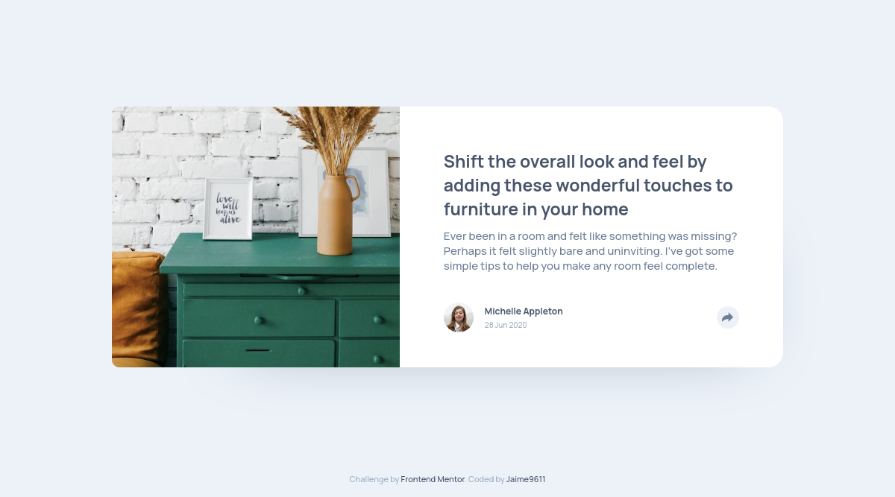
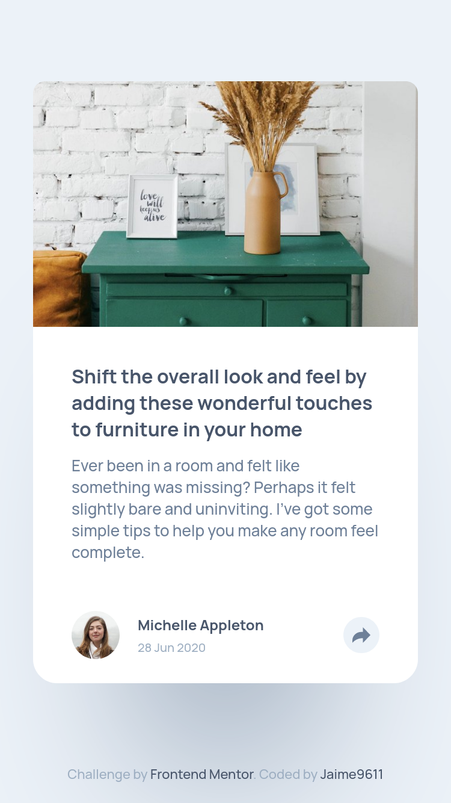

# Frontend Mentor - Article preview component solution

This is a solution to the [Article preview component challenge on Frontend Mentor](https://www.frontendmentor.io/challenges/article-preview-component-dYBN_pYFT). Frontend Mentor challenges help you improve your coding skills by building realistic projects.

## Table of contents

- [Overview](#overview)
  - [The challenge](#the-challenge)
  - [Screenshot](#screenshot)
  - [Links](#links)
- [My process](#my-process)
  - [Built with](#built-with)
  - [What I learned](#what-i-learned)
  - [Continued development](#continued-development)
  - [Useful resources](#useful-resources)
- [Author](#author)
- [Acknowledgments](#acknowledgments)

**Note: Delete this note and update the table of contents based on what sections you keep.**

## Overview

### The challenge

Users should be able to:

- View the optimal layout for the component depending on their device's screen size
- See the social media share links when they click the share icon

### Screenshot

- Desktop Preview:

  

- Mobile Preview:

  

### Links

- Solution URL: [Mobile First Solution - Sass](https://www.frontendmentor.io/solutions/mobile-first-solution-using-sass-_144e8Jae)
- Live Site URL: [Live Site](https://jaime9611.github.io/ArticleComponent/)

## My process

### Built with

- Semantic HTML5 markup
- SASS
- Flexbox
- Mobile-first workflow

### What I learned

Simple styling using Sass, Flexbox for layout and the use of Mobile First workflow.

### Continued development

Continue learning Sass and use of its Mixins properties.

### Useful resources

- [MDN](https://developer.mozilla.org/es/docs/Learn) - This helped me for reviewing CSS properties and Javascript coding.
- [W3Schools](https://www.w3schools.com/css/) - This is an useful resource for css properties and simple use cases.

## Author

- Github - [Jaime9611](https://github.com/Jaime9611)
- Frontend Mentor - [@Jaime9611](https://www.frontendmentor.io/profile/Jaime9611)
